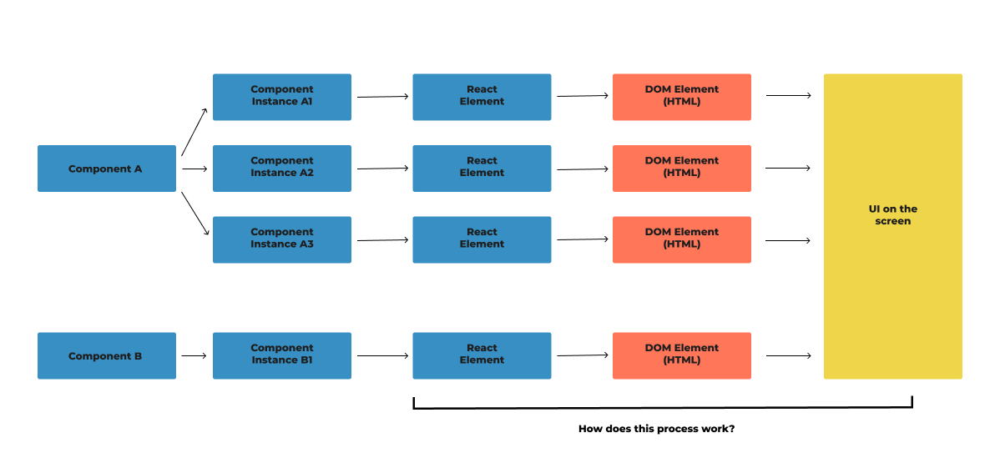
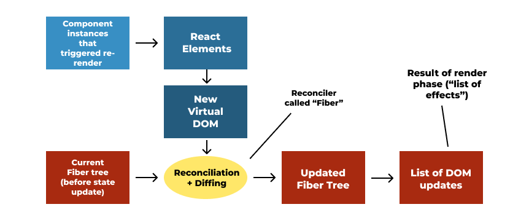
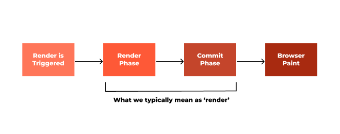
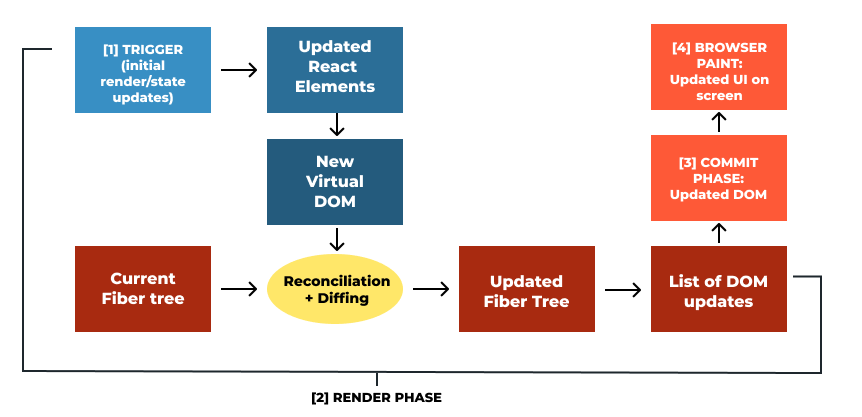

# How React Works Behind the Scenes

I am currently following **Jonas Schmedtmann's** course on React.js and have decided to create detailed notes for future reference. These notes will be stored in this repository. When needed, I will create diagrams in Figma to explain particular sections visually.

## Table of Contents

- [**Section 1:** React, Props, and State](#section-1-what-is-react)
- [**Section 2:** Components, Instances, and Elements](#section-2-components-instances-and-elements)
  - [Summary](#section-2-summary)
- [**Section 3:** How Rendering Works](#section-3-how-rendering-works)
  - [Overview](#overview)
  - [Render Phase Steps](#render-phase-steps)
  - [The Reconciler and Fiber Architecture](#the-reconciler-and-fiber-architecture)
  - [Diffing Algorithm](#diffing-algorithm)
  - [The Commit Phase](#the-commit-phase)
  - [Summary of Section 3](#summary-of-section-3)

---

## Section 1: What is React?

React is a JavaScript library used for building user interfaces. Here's a brief overview of its core principles:

- **Declarative**: We tell React what we want, and it figures out how to do it.
- **Library, not a framework**: React provides tools for UI building but doesn't impose structure like a framework.
- **Component-based**: Reusable components are the building blocks of React apps.
- **Unidirectional Data Flow**: Data flows from parent to child components.
- **Virtual DOM**: React uses a virtual DOM (JavaScript representation of the actual DOM) to optimize rendering.
- **Popularity**: React is widely used and has a large community of developers.

### What are props?

Props (short for properties) are used to pass data from one component to another, usually from parent to child components.

- They are read-only (immutable).
- Useful for configuring and customizing components, making them dynamic and reusable.

### What is state?

State represents local data specific to a component. Unlike props, state can change over time.

- **Mutable**: State can be updated using React's `setState` method (or using hooks like `useState`).
- **Triggers re-render**: When the state changes, the component re-renders.
- **Maintains UI updates**: State allows the UI to respond to user events and preserve component-specific data between renders.

---

## Section 2: Components, Instances, and Elements

React’s core building blocks revolve around components, instances, and elements.

### Components

A component is a function that returns a piece of the user interface (UI) described using JSX.

```jsx
function Tab({ item }) {
  return (
    <div>
      <h4>All Contacts</h4>
      <p>Content: {item}</p>
    </div>
  );
}
```

- They describe a piece of UI, like the Tab component above.
- Components are functions that can return JSX, which is later transformed into React elements.
- A reusable 'Blueprint' or 'Template' for UIs.

### Instances

When we "use" a component, we create an instance of that component.

```JSX
    function App() {
        return (
            <div className="tabs">
                <Tab item={content[0]}/>
                <Tab item={content[1]}/>
                <Tab item={content[2]}/>
            </div>
        )
    }
```

- Instances are created whenever we use a component multiple times.
- React internally calls the component function (e.g., Tab()).
- Each instance has its own state and props, making it a "physical" representation of the component.
- We sometimes use components and component instances interchangeably (e.g. a UI is made up of components when in fact they are made of component instances) but they are different

### React Elements

When a component instance is rendered, it creates a React element.

- JSX is converted to React.createElement() function calls.
- A React element is an object containing all the information needed to render the component's DOM elements.

### DOM Elements

Once React elements are created, they are used to generate actual DOM elements (HTML) that are displayed in the browser.

- React elements are virtual representations, while DOM elements are their physical counterpart in the browser.

### Section 2 Summary


_Figure 1: Components, Instances, Elements and DOM Elements_

- **Components**: act as the blueprints or templates for the UI
- **Instances**: Physical manifestations of components with their own state and props.
- **React Elements**: Created when JSX is converted into React.createElement() calls. These elements are used to build the virtual DOM.
- **DOM elements**: The actual HTML elements rendered in the browser.

## Section 3: How Rendering Works

### Overview

At the highest level, rendering in React means taking your components and turning them into actual HTML elements that the browser can display. But before that happens, React goes through several steps to ensure the UI is efficiently updated based on the current state of the app.

#### What is a React Component?

A React component is a function or class that returns JSX (which is JavaScript XML). This JSX represents what the user interface (UI) should look like, including what HTML elements are shown and how they interact with data.

For example:

```jsx
function Greeting() {
  return <h1>Hello, World!</h1>;
}
```

In this case, the component is `Greeting`, and when called, it returns the JSX `<h1>Hello, World!</h1>`.

#### The Render Function

When React renders a component, it follows these steps:

1. **React calls the component function**:

   - The component function (like `Greeting()`) runs and returns JSX.

2. **JSX is turned into a React element**:

   - React elements are lightweight JavaScript objects that describe the UI. These elements are not HTML but tell React what HTML needs to be created.

   Example:

   ```javascript
   const reactElement = { type: "h1", props: { children: "Hello, World!" } };
   ```

#### What is the Virtual DOM?

The **Virtual DOM** is an internal copy of the actual DOM. It's not displayed in the browser; instead, it’s a lightweight version of the DOM that lives in memory. Think of it as a blueprint of what your UI should look like at any given time.

- Why does React use a Virtual DOM?
  - Efficiency: Updating the actual DOM can be slow because the browser has to re-draw parts of the page. React minimizes the number of updates by first making changes to the Virtual DOM. It compares the Virtual DOM to a previous version (a process called diffing) and then applies the smallest number of updates to the real DOM.

### Render Phase Steps

Now that we understand components, React elements, and the Virtual DOM, here’s what happens during the render phase:

1. **React calls the render function**: This means React invokes the component’s function (like `Greeting()`) to generate a React element.

2. **Virtual DOM update**:
   - The React element created in step 1 is used to update the Virtual DOM. If the Virtual DOM has changed since the last render, React figures out the minimum changes that need to be applied to the real DOM.
   - For example, if your component only changed one small part of the UI, React will update only that part in the real DOM.

> **Note**: When React renders a component, it also renders all of its child components to ensure the entire tree is up to date. This happens even if some child components haven't changed.

  
_Figure 2: The Render Phase_

### The Reconciler and Fiber Architecture

The reconciler is the part of React that compares the Virtual DOM with the real DOM and decides what needs to be updated.

**What is Fiber?**
Fiber is a key part of React's architecture designed to improve performance by breaking the rendering process into smaller, manageable chunks

- Traditional DOM updates happen all at once. If your app has a large component tree, updating the entire tree could slow down your app and make it unresponsive.
- Fiber architecture allows React to break the work into small pieces and spread it out over multiple frames. This way, React can:
  - Pause work.
  - Resume work.
  - Abort unnecessary work.
  - This prevents the main JavaScript thread from being blocked, ensuring that the app remains responsive.

#### How Does Fiber Work?

**Fiber Tree Creation**

On the initial render, React creates a Fiber tree. This Fiber tree represents the entire component tree, but in a more efficient, linked-list format.

- Each component instance (like Greeting()) and each DOM element has a corresponding fiber node.
- Fiber nodes keep track of:
  - Component state (i.e., what data is changing).
  - Props (i.e., data passed down from parent components).
  - Side effects (i.e., updates that need to happen, like DOM changes or useEffect logic).

**Persistent and Mutable Structure**:
One of the key features of Fiber is that the Fiber tree is persistent. This means that it’s not re-created every time a component re-renders.

- Instead, the tree is mutated when a component changes. React doesn’t need to create new fibers from scratch—it can update only what needs to change.

**Fiber: Unit of Work**:
A fiber is also known as a unit of work. Each fiber (each node in the Fiber tree) represents a chunk of work that React needs to do, such as updating state or making DOM updates. Because the Fiber architecture breaks down rendering into these chunks, React can work on them in small parts, pausing or aborting when needed.

**Linked List and Sibling Relationships**:
Unlike the typical parent-child structure of the React element tree, the Fiber tree is structured as a linked list, where fibers are arranged in sibling relationships. This structure allows React to traverse the tree more efficiently and manage work in smaller portions.

**Asynchronous Rendering**:
The Fiber architecture enables React to handle rendering asynchronously, meaning it doesn’t have to complete everything in one go.

- Asynchronous work means React can pause and resume rendering whenever needed.
- If React is rendering a large component tree, it can break that work into smaller tasks, preventing long renders from blocking the main JavaScript thread (which is responsible for user interactions, animations, etc.).
  This ensures the app stays responsive, even during complex or long renders.

### Diffing Algorithm

When React updates the Virtual DOM, it uses a diffing algorithm to compare the old Virtual DOM with the new one. This algorithm helps React determine what has changed and what needs to be updated in the real DOM.

Now, let’s use a fun analogy to explain diffing. Imagine you’re playing a “spot the difference” game where you have two seemingly identical images, but there are small differences between them.

- **Old Virtual DOM**: This is the first image.
- **New Virtual DOM**: This is the second image after changes in the app (like a state update).

React needs to figure out the differences between these two images (Virtual DOMs). The process of finding the differences is called diffing. But React doesn’t just compare pixel-by-pixel. It uses some smart strategies to speed up the process:

1. **Same Type of Element**: React assumes that if two elements are the same type (like two `<div>` elements), it doesn’t need to look too deeply inside them unless their attributes or children have changed.

   Example:

   - You have a `<div>` containing text. After a state update, the text inside the `<div>` changes.
   - React will only compare the content of the `<div>`, not the entire structure of the element.

2. **Keys for Lists**: Imagine you’re comparing two lists of items. React uses keys to identify which items are new, which have been removed, and which have been moved around.

   Example:

   - Let’s say you have a list of three items: `["Apple", "Banana", "Cherry"]`.
     You change the list to `["Banana", "Apple", "Cherry"]`.
   - By using keys (unique identifiers for each item), React can see that only the order of the first two items has changed, so it only updates those items, not the entire list.

### The Commit Phase

**React’s Rendering Phases: The Big Picture**

When you interact with a React application (like clicking a button), React needs to recalculate and update the UI to reflect any changes. This is done through two main phases:

- **Render Phase**: React calculates what needs to be changed by comparing the new state of the app to the old one.
- **Commit Phase**: React applies those changes to the real DOM and makes them visible to the user.



_Figure 3: The Render Phase and the Commit Phase_

Now, let’s dive into the commit phase.

The commit phase is the second phase of React’s update process. Once React has figured out what needs to be changed during the render phase, it moves on to actually updating the DOM in the commit phase.

#### What Happens in the Commit Phase?

1. **Inserting, Deleting, and Updating DOM Elements:**

   - React takes the list of changes (calculated during the render phase) and applies them to the real DOM. It might:
     - Insert new elements (like adding a new list item),
     - Delete elements (removing an old item),
     - Update existing elements (changing a button’s text).
   - These DOM changes are synchronous, meaning they happen all at once without interruption. This ensures that the browser always has a fully consistent UI to display.

2. **Flushing Updates:**

   - React processes the effects list (side effects) created during the render phase, flushing (applying) those changes to the actual DOM.
   - Side effects could include anything from updating state, setting refs, to triggering useEffect hooks.
   - The effects list keeps track of all the changes React needs to apply (see figure 2)

#### Why Must the Commit Phase Be Synchronous?

- The commit phase is synchronous, meaning that React updates the entire DOM in one go. This is necessary because:
  - If React paused halfway through updating the DOM, the user might see a partial update (a broken UI where only some changes are visible).
  - By updating everything in one step, React ensures the user interface is always in a consistent, correct state.

#### Render Phase vs. Commit Phase

- **Render Phase**:

  - Can be paused, resumed, and even discarded. This is why it can handle complex operations without blocking the main thread, keeping the app responsive.
  - React builds a list of updates (the work it needs to do) but doesn’t yet apply them to the DOM.
  - The Fiber tree (React’s internal data structure) is updated, but no visible changes happen yet (it creates a work-in-progress tree).

- **Commit Phase**:
  - Cannot be interrupted. Once React starts updating the DOM, it finishes in one go.
  - This is when the calculated updates (from the render phase) are flushed to the DOM.
  - After the commit phase, the user can see the new, updated UI.

#### Fiber and the Commit Phase

**The Fiber Tree**

- In React, each element/component has a corresponding fiber (an object that holds information about the component’s state, props, and DOM updates).
- React builds and updates a Fiber tree during the render phase, where each fiber corresponds to a React element or DOM element.
- Once React completes the commit phase, the work-in-progress Fiber tree becomes the current Fiber tree. This means React doesn’t throw away the Fiber tree after each update but keeps reusing it, which saves time.

#### What Happens After the Commit Phase?

1. **Browser Paint:**
   - After React updates the DOM in the commit phase, the browser notices the DOM changes.
   - The browser schedules a paint operation, where it re-renders the user interface on the screen. This happens asynchronously, whenever the browser has idle time.
2. **Effect Hooks (useEffect)**:

   - Once the DOM is updated, React runs any side effects like useEffect hooks. These side effects can involve tasks like fetching data from APIs, adding event listeners, etc.
   - For example:

   ```javascript
   useEffect(() => {
     console.log("This runs after the commit phase");
   }, []);
   ```



_Figure 4: Recap - The React Rendering Process_

#### React vs. React DOM: Who Does What?

React has two main pieces:

1.  **React (the Library)**:

    - React is the core library that handles the render phase. It figures out what changes need to be made and builds the Virtual DOM (or Fiber tree), but React itself doesn’t actually touch the real DOM.

2.  **React DOM (the Renderer)**:

    - React DOM is the part responsible for the commit phase. It takes the changes calculated by React and applies them to the DOM. This is why you need both `React` and `ReactDOM `in your `index.js` file:

      ```javascript
      import React from "react";
      import ReactDOM from "react-dom";
      ```

    - React DOM takes care of the commit phase, making sure the browser sees the correct UI. It is technically a renderer that deals specifically with the DOM.

#### React and Different Hosts

React was designed to be platform-independent, meaning it can work with many different environments (called hosts). The commit phase could be directed toward different output targets, depending on the platform. React can be used to create:

- **Web apps**: Using React DOM, which updates the real DOM in web browsers.
- **Native mobile app**s: Using React Native, which applies updates to native mobile components.
- **Other platforms**: You can even create documents (PDFs, Figma designs, etc.) using other renderers.

Each of these hosts (like React DOM or React Native) is responsible for applying the changes in the commit phase. The concept of a Virtual DOM really only makes sense in the context of web apps because on other platforms (like mobile), React is managing updates to a different kind of element.

#### Why Does React Split the Render and Commit Phases?

React divides its work into two phases (render and commit) to improve efficiency and performance:

- Render Phase: Can be paused and resumed, allowing React to handle heavy computations or complex updates without freezing the app. It allows concurrent rendering.
- Commit Phase: Must happen synchronously to ensure the UI remains consistent and is updated in one go. It flushes all the changes to the real DOM.

This split allows React to make the app responsive even when handling lots of updates.

### Summary of Section 3

Let’s bring it all together with a more complex example:

- Imagine you have a React app with a list of users displayed as cards, a search bar, and a "load more" button at the bottom.
- You type into the search bar, which triggers a state update that filters the list of users.
- Meanwhile, you also click the "load more" button to add more users to the list.

Here’s how React handles this efficiently:

1. **Virtual DOM Updates**: When you type into the search bar, React updates the Virtual DOM to reflect the new, filtered list of users.

2. **Diffing**: React compares the old Virtual DOM (with all users) to the new Virtual DOM (with filtered users). Since only some users need to be removed from the list, React figures out the minimal changes required and only updates the affected user cards in the real DOM.

3. **Fiber Prioritization**: Since typing in the search bar is a higher-priority action (it affects what the user sees immediately), React uses Fiber to prioritize updating the user list, while pausing the "load more" updates in the background. Once the user list is updated, React can resume work on loading more users.

4. **Commit Phase**: After reconciliation and diffing, React enters the commit phase and applies the necessary changes to the real DOM—updating only the relevant user cards and leaving the rest of the DOM untouched.
