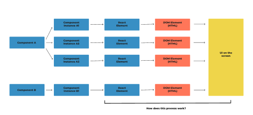

# How React Works Behind the Scenes

I am currently following **Jonas Schmedtmann's** course on React.js and have decided to create detailed notes that I can refer back to. These notes will be stored in this repository. I will also create diagrams, when needed, in figma as means to explain particular sections.

## Table of Contents

- [**Section 1:** Components, Instances and Elements](#components-instances-and-elements)
  - [Section 1 Summary](#section-1-summary)

## Components, Instances and Elements

### Components

```JSX
    function Tab({ item }) {
        return (
            <div>
                <h4>All Contacts</h4>
                <p>Content: {item}</p>
            </div>
        )
    }
```

- They describe a piece of UI (e.g. Tab)
- A function that returns React Elements (element tree), normally written as JSX
- A 'Blueprint' or 'Template'

### Instances

```JSX
    function App() {
        return (
            <div className="tabs">
                <Tab item={content[0]}/>
                <Tab item={content[1]}/>
                <Tab item={content[2]}/>
            </div>
        )
    }
```

- Instances are created when we 'use' a component - we can use the same component multiple times
- React internally calls Tab()
- 'Physical' manifestation of component
- Has own state and props; has its own lifecycle
- We sometimes use components and component instances interchangeably (e.g. a UI is made up of components when in fact they are made of component instances) but they are different

### React Elements

- As react executes the code in each of these instances, they will each return one or more react elements.
- JSX is converted to React.createElement() function calls and a React element is the result
- A React element contains all the info necessary to create DOM elements for the current component instance

### DOM Elements

- A React element is converted into actual DOM elements (HTML) - the actual visual representation of the component instance in the browser
- React elements are not rendered to the DOM, they live inside the app

### Section 1 Summary


